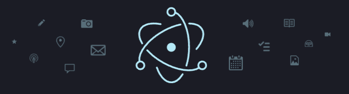

# Electron 발표 자료

# Electron이란?

[https://www.npmjs.com/package/electron](https://www.npmjs.com/package/electron)



“_Electron is a framework for building desktop applications using JavaScript, HTML, and CSS._”

웹 기술(HTML, CSS, JS)을 사용해 데스크탑 애플리케이션 개발을 가능하게 해주는 프레임워크

### 주요 히스토리

- 2013.04 : Atom Editor를 만들기 위해 Atom Shell이라는 이름으로 시작
- 2014.05 : MIT 라이선스 오픈소스로 전환
- 2015.04 : Atom Shell에서 Electron으로 명칭 변경
- 2016.05 : Electron V1.0 출시 (현재는 29.1.4 버전까지 나옴)
- Github에 의해 유지보수 및 개발되고 있음

### 장단점

- 장점
  - 낮은 러닝 커브
  - 크로스 플랫폼 지원
  - 크로스 브라우징을 위한 작업 필요 없음
  - 풍부한 OS 네티이브 API를 가진 런타임 제공 : https://github.com/electron/electron-api-demos/releases
  - 써드파티 지원
  - 빌드 툴과 인스톨러 제공
  - 활성화된 커뮤니티
- 단점
  - 큰 설치 파일 용량
  - 리소스 소모 및 상대적으로 느린 속도
  - 보안 이슈
  - 크로스 플랫폼 빌드
  - 모바일 미지원

### Electron을 사용하는 대표적인 애플리케이션들

[https://www.electronjs.org/apps](https://www.electronjs.org/apps)

# Electron vs PWA vs Tauri

[https://npmtrends.com/@tauri-apps/cli-vs-electron-vs-next-pwa](https://npmtrends.com/@tauri-apps/cli-vs-electron-vs-next-pwa)

### Electron vs PWA


[https://felixrieseberg.com/progressive-web-apps-electron/](https://felixrieseberg.com/progressive-web-apps-electron/)

[https://cleancommit.io/blog/pwa-vs-electron-which-architecture-wins/](https://cleancommit.io/blog/pwa-vs-electron-which-architecture-wins/)

[https://javascript.plainenglish.io/is-electron-the-best-desktop-framework-to-use-in-2021-e525638b9b6a](https://javascript.plainenglish.io/is-electron-the-best-desktop-framework-to-use-in-2021-e525638b9b6a)

Electron 앱은 완전한 기본 데스크탑 애플리케이션인데 반해,
PWA는 PWA를 구동하는 브라우저의 범위 내에 존재함

- 설치 및 업데이트 : Electron < PWA
- 보안 : Electron < PWA
- 크기 : Electron < PWA
- 성능 : Electron < PWA
- 모바일 : Electron < PWA
- 설치 과정 : Electron > PWA
- 기능 명확성 : Electron > PWA
- 네이티브 기능 : Electron > PWA
- 오프라인 기능 : Electron > PWA

### Electron vs Tauri


[https://medium.com/@DhruvK_Sethi/tauri-vs-electron-a-new-dawn-in-desktop-app-development-16f13372b8fc](https://medium.com/@DhruvK_Sethi/tauri-vs-electron-a-new-dawn-in-desktop-app-development-16f13372b8fc)

[https://www.levminer.com/blog/tauri-vs-electron](https://www.levminer.com/blog/tauri-vs-electron)

- Electron의 부족한 부분을 보완함
  - 자원 효율성
  - 높은 네이티브 통합성
  - 강화된 보안
  - 높은 유연성 (다양한 언어 선택 등)
  - 더 작은 번들 크기
- 단점
  - 커뮤니티가 아직 작음
  - 기능을 심화적으로 사용하고 싶다면 Rust를 배워야 함

# Electron의 구성요소


- Electron은 프론트엔드로 Chromium을, 백엔드로 Node.js를 사용.
  Chromium과 Node.js는 V8을 공유하며 이로 인해 웹 기술과 네이티브 시스템 리소스에 모두 접근 가능
- Chromium과 Node.js를 바이너리에 내장함으로써 독립적으로 데스크탑에서 실행이 가능하며,
  하나의 JS 코드 베이스를 유지하고 Window, MacOS, Linux에서 작동하는 크로스 플랫폼 앱을 만들 수 있도록 해줌

### Chromium

[https://chromium.woolyss.com/download/](https://chromium.woolyss.com/download/)

[https://ykarma1996.tistory.com/72](https://ykarma1996.tistory.com/72)

- Google Chrome 브라우저의 오픈소스 버전
- Electron의 Renderer 프로세스에서 사용됨
- Electron은 Chromium을 통해 웹 기술을 애플리케이션에 적용할 수 있으며, 렌더링 엔진으로 사용함.
  즉, Chromium을 사용해서 데스크탑 애플리케이션의 UI를 구성하고 사용자 인터페이서를 렌더링함
- Electron에는 Chromium의 모든 부분을 사용하는게 아니라 렌더링 라이브러리 부분만 사용하기 때문에
  구글 크롬에서 볼 수 있는 브라우저와 관련된 몇몇 기능들은 존재하지 않음
- Chromium
  
  [https://www.lambdatest.com/blog/difference-between-chrome-and-chromium/#:~:text=Chromium is an open-source and free web browser that,%2C AAC%2C and Adobe Flash](https://www.lambdatest.com/blog/difference-between-chrome-and-chromium/#:~:text=Chromium%20is%20an%20open%2Dsource%20and%20free%20web%20browser%20that,%2C%20AAC%2C%20and%20Adobe%20Flash)
  - 2008년 9월에 구글에서 시작한 오픈소스 프로젝트 “크로미움”.
    해당 프로젝트를 통해 만들어진 소스코드에서 컴파일된 브라우저 ⇒ 크로미움
  - 크롬, 엣지, 오페라, 네이버 웨일 등의 브라우저들이 크로미움을 기반으로 제작됨
  - Chromium에 여러가지 기능 및 요소를 추가해 탄생한 브라우저가 Chrome

### Node.js

- 서버 측 Javascript 런타임 환경인 Node.js가 일렉트론 내부에 포함되어 있음
- 일렉트론의 Main 프로세스에서 사용됨
- Main 프로세스는 주로 애플리케이션의 주요 로직을 담당하며,
  파일 시스템 접근, 네트워크 통신, 외부 API 호출 등의 작업을 처리하는데 Node.js를 사용함
- Electron은 Node.js를 바이너리에 내장하므로
  코드를 실행하는 Node.js 버전은 시스템에서 실행되는 버전과 관련 없음

### Electron API

- Electron은 Chromium과 Node.js 간의 통합을 단순화하기 위해 추가적인 API를 제공함
- 해당 API는 데스크탑 애플리케이션을 개발하는데 필요한 다양한 기능과 리소스에 쉽게 접근할 수 있도록 함

# Electron의 구조


[https://iyu88.github.io//electron/2023/02/24/electron.html](https://iyu88.github.io//electron/2023/02/24/electron.html)

### Main Process

- 주요 프로세스로 Electron 애플리케이션의 생명 주기 관리, Render Process 관리, OS 관련 API 제어같은 핵심 제어를 담당
- Node.js 환경에서 실행되며 네이티브 기능에 접근 가능함
- 주로 main.js 파일에 정의되며, 여기에서 전반적인 애플리케이션의 동작을 구현

### Renderer Process

- 각각의 창(window)에 대한 웹 페이지를 렌더링하고 사용자 인터페이스를 담당하는 프로세스
- Chromium 브라우저의 렌더링 엔진을 기반으로 함.
  따라 HTML, CSS, JS를 사용해 웹 페이지를 만들 듯 view 구성 가능
- 각각의 renderer 프로세스는 독립적으로 실행됨
- 하나의 Electron 애플리케이션은 여러 개의 렌더러 프로세스를 가질 수 있음

### IPC(Inter-Process Communication)

- 메인 프로세스와 렌더러 프로세스 간의 통신을 담당
- 주로 **`ipcMain`**과 **`ipcRenderer`** 모듈을 사용해 IPC를 구현
- 이를 통해 메인 프로세스와 렌더러 프로세스 사이에서 데이터를 주고받고, 특정 이벤트에 대한 처리 가능

```jsx
// Main Process
const { ipcMain } = require("electron");

// ipcMain.on 메서드를 사용해 Main 프로세스에서 'message-from-render-process' 이벤트 수신 대기
// 이벤트가 발생하면 해당 콜백 함수가 실행되며, 인자로 받은 메세지를 출력한 후
// 'message-from-main-process' 이벤트로 'pong'이라는 응답 메세지를 렌더러 프로세스에게 보냄
ipcMain.on("message-from-render-process", (event, arg) => {
  console.log(arg); // prints "ping"

  // send a reply message to the render process
  event.reply("message-from-main-process", "pong");
});

// Render Process
const { ipcRenderer } = require("electron");

// send a message to the main process
ipcRenderer.send("message-from-render-process", "ping");

// listen for messages from the main process
ipcRenderer.on("message-from-main-process", (event, arg) => {
  console.log(arg); // prints "pong"
});
```


# 실습

### 기본 구성 파일

[https://www.electronjs.org/docs/latest/tutorial/quick-start](https://www.electronjs.org/docs/latest/tutorial/quick-start)

```html
<!DOCTYPE html>
<html lang="en">
  <head>
    <meta charset="UTF-8" />
    <meta
      name="viewport"
      content="width=device-width, user-scalable=no, initial-scale=1.0, maximum-scale=1.0, minimum-scale=1.0"
    />
    <meta http-equiv="X-UA-Compatible" content="ie=edge" />
    <title>미니미니언즈</title>
  </head>
  <body>
    <h1>Hello, World!</h1>
    <p>
      It's using Node.js <span id="node-version"></span>, Chromium
      <span id="chrome-version"></span> and Electron
      <span id="electron-version"></span>.
    </p>
  </body>
</html>
```

```jsx
//main.js

const {
  app, // 애플리케이션의 이벤트 수명주기를 제어하는 모듈
  BrowserWindow, // 응용 프로그램 창을 생성하고 관리하는 모듈
} = require("electron");
const path = require("path");

// hot reload
require("electron-reload")(__dirname, {
  electron: path.join(__dirname, "node_modules", ".bin", "electron"),
});

// window 객체는 전역 변수로 유지. 전역 변수로 유지하지 않으면 JS 객체가 가비지 컬렉트 될 때 자동으로 창이 닫힘
let win;

const createWindow = () => {
  // 브라우저 창 생성
  win = new BrowserWindow({
    // 이 모듈은 app 모듈의 ready 이벤트가 발생할 때까지 사용할 수 없음
    width: 640,
    height: 480,
    resizable: false,
    webPreferences: {
      // 환경설정 객체 : https://www.electronjs.org/docs/latest/api/structures/web-preferences
      preload: path.join(__dirname, "preload.js"), // 페이지에서 다른 스크립트가 실행되기 전에 로드될 전처리 스크립트 지정. 절대 경로로 전달해야함
      // __dirname : 현재 실행 중인 스크립트의 경로를 가리킴
      // path.join : 여러 경로 세그먼트를 함께 결합해 모든 플랫폼에서 작동하는 결합된 경로 문자열을 생성함
    },
  });

  // 창에서 불러들일 원격 URL 지정
  // win.loadURL('https://github.com');

  // 창에서 불러들일 HTML 문서 지정
  win.loadFile("index.html");

  // 개발자 도구 열기
  win.webContents.openDevTools();

  // 창이 닫힐 때 발생
  win.on("close", () => {
    // window 객체에 대한 참조해제
    win = null;
  });
};

app.whenReady().then(() => {
  // app 모듈의 준비 이벤트를 기다림
  createWindow();

  // 열려 있는 창이 없으면 창 열기
  app.on("activate", () => {
    // macOS에서는 dock 아이콘이 클릭되고 다른 윈도우가 열려있지 않았다면 앱에서 새로운 창을 여는것이 일반적임
    if (BrowserWindow.getAllWindows().length === 0) {
      createWindow();
    }
  });

  // 모든 창일 닫힐 때 앱 종료
  app.on("window-all-closed", () => {
    // macOS에서는 사용자가 명확하게 Cmd + Q를 누르기 전까지는 애플리케이션이나 메뉴바가 비활성화된 상태로 머물러 있음
    if (process.platform !== "darwin") {
      app.quit();
    }
  });
});
```

```jsx
//preload.js

// 사전 로드 스크립트는 렌더러 프로세스가 로드되기 전에 실행되며,
// 렌더러 전역(window, document)과 Node.js 환경에 모두 액세스 가능함
window.addEventListener("DOMContentLoaded", () => {
  const replaceText = (selector, text) => {
    const element = document.getElementById(selector);
    if (element) element.innerText = text;
  };

  for (const type of ["chrome", "node", "electron"]) {
    // Node.js precess.version 객체에 액세스하고 기본 replaceText 도우미 함수를 실행해 HTML 문서에 버전 번호를 삽입함
    replaceText(`${type}-version`, process.versions[type]);
  }
});
```

### 간단히 화면 Custom 해보기 (메뉴바, 타이틀바)

[https://codegear.tistory.com/20](https://codegear.tistory.com/20)

```html
<!DOCTYPE html>
<html lang="en">
  <head>
    <meta charset="UTF-8" />
    <meta
      name="viewport"
      content="width=device-width, user-scalable=no, initial-scale=1.0, maximum-scale=1.0, minimum-scale=1.0"
    />
    <meta http-equiv="X-UA-Compatible" content="ie=edge" />
    <title>미니미니언즈</title>
    <style>
      body {
        font-family: -apple-system, BlinkMacSystemFont, "Segoe UI", Roboto,
          Helvetica, Arial, sans-serif;
        margin: 0;
      }

      body * {
        box-sizing: border-box;
      }

      .container {
        height: 100%;
        padding: 0;
        display: grid;
        grid-template-rows: auto 1fr;
      }

      .title-bar {
        width: 100%;
        padding: 5px 20px;
        display: flex;
        align-items: center;
        justify-content: space-between;
        background: #000000;
        font-family: Impact, Haettenschweiler, "Arial Narrow Bold", sans-serif;
        color: #ffffff;
        font-size: 15px;
      }

      .draggable {
        -webkit-app-region: drag;
      }

      .title {
        flex: 1;
      }

      .prevent-select {
        display: flex;
        align-content: center;
        user-select: none;
        -webkit-touch-callout: none;
        -webkit-user-select: none;
      }

      .control {
        float: right;
        display: grid;
        grid-template-columns: 1fr 1fr 1fr;
        gap: 4px;
      }

      .control button {
        padding: 5px;
        background: #000000;
        border: 1px solid #fff;
        color: #ffffff;
        outline: 0;
        font-family: Impact, Haettenschweiler, "Arial Narrow Bold", sans-serif;
        cursor: pointer;
      }

      .control button:hover {
        background: #444444;
      }
    </style>
  </head>
  <body>
    <div class="container">
      <div class="title-bar ">
        <div class="title prevent-select draggable">Custom Title Bar</div>
        <div class="control prevent-select">
          <button id="min">Min</button>
          <button id="max">Max</button>
          <button id="close">Close</button>
        </div>
      </div>

      <h1>Hello, World!</h1>
      <p>
        It's using Node.js <span id="node-version"></span>, Chromium
        <span id="chrome-version"></span> and Electron
        <span id="electron-version"></span>.
      </p>
    </div>

    <script src="./function.js"></script>
  </body>
</html>
```

```jsx
//fuction.js
const { ipcRenderer } = require("electron");
const ipc = ipcRenderer;

const btnMin = document.getElementById("min");
const btnMax = document.getElementById("max");
const btnClose = document.getElementById("close");

//ipcRender의 send를 이용하여 main 프로세스로 이벤트를 요청합니다.
btnMin.addEventListener("click", () => {
  ipc.send("minimizeApp");
});

btnMax.addEventListener("click", () => {
  ipc.send("maximizeApp");
});

btnClose.addEventListener("click", () => {
  ipc.send("closeApp");
});
```

```jsx
// main.js
const { app, BrowserWindow, Menu, shell, ipcMain } = require("electron");
const path = require("path");

require("electron-reload")(__dirname, {
  electron: path.join(__dirname, "node_modules", ".bin", "electron"),
});

let win;
const ipc = ipcMain;

const createWindow = () => {
  win = new BrowserWindow({
    width: 640,
    height: 480,
    frame: false, //일렉트론 디폴트 타이틀바 제거
    webPreferences: {
      nodeIntegration: true,
      contextIsolation: false,
      preload: path.join(__dirname, "preload.js"),
    },
  });

  win.loadFile("index.html");

  win.on("close", () => {
    win = null;
  });
};

app.whenReady().then(() => {
  createWindow();

  const template = [
    {
      label: "File",
      submenu: [{ role: "quit" }],
    },
    {
      label: "Edit",
      submenu: [
        { role: "undo" },
        { role: "redo" },
        { role: "separator" },
        { role: "cut" },
        { role: "copy" },
        { role: "paste" },
        { role: "pasteandmatchstyle" },
        { role: "delete" },
        { role: "selectall" },
      ],
    },
    {
      label: "Help",
      submenu: [
        { role: "reload" },
        { role: "toggleFullScreen" },
        { role: "toggleDevTools" },
      ],
    },
    {
      label: "Custom Event",
      submenu: [
        {
          label: "children",
          click: function () {
            shell.openExternal("https://naver.com");
          },
        },
        {
          label: "console log",
          click: function () {
            console.log("Clicked menu Open");
          },
        },
      ],
    },
  ];
  const menu = Menu.buildFromTemplate(template);
  Menu.setApplicationMenu(menu);

  app.on("activate", () => {
    if (BrowserWindow.getAllWindows().length === 0) {
      createWindow();
    }
  });

  app.on("window-all-closed", () => {
    if (process.platform !== "darwin") {
      app.quit();
    }
  });
});

ipc.on("minimizeApp", () => {
  win.minimize();
});

ipc.on("maximizeApp", () => {
  if (win.isMaximized()) {
    win.restore();
  } else {
    win.maximize();
  }
});

ipc.on("closeApp", () => {
  win.close();
  console.log("close event");
});
```

### Renderrer 프로세스 여러 개 띄우기

```html
<!DOCTYPE html>
<html lang="en">
  <head>
    <meta charset="UTF-8" />
    <meta
      name="viewport"
      content="width=device-width, user-scalable=no, initial-scale=1.0, maximum-scale=1.0, minimum-scale=1.0"
    />
    <meta http-equiv="X-UA-Compatible" content="ie=edge" />
    <title>미니미니언즈</title>
    <style>
      body {
        font-family: -apple-system, BlinkMacSystemFont, "Segoe UI", Roboto,
          Helvetica, Arial, sans-serif;
        margin: 0;
      }

      body * {
        box-sizing: border-box;
      }

      .container {
        height: 100%;
        padding: 0;
        display: grid;
        grid-template-rows: auto 1fr;
      }

      .title-bar {
        width: 100%;
        padding: 5px 20px;
        display: flex;
        align-items: center;
        justify-content: space-between;
        background: #000000;
        font-family: Impact, Haettenschweiler, "Arial Narrow Bold", sans-serif;
        color: #ffffff;
        font-size: 15px;
      }

      .draggable {
        -webkit-app-region: drag;
      }

      .title {
        flex: 1;
      }

      .prevent-select {
        display: flex;
        align-content: center;
        user-select: none;
        -webkit-touch-callout: none;
        -webkit-user-select: none;
      }

      .control {
        float: right;
        display: grid;
        grid-template-columns: 1fr 1fr 1fr;
        gap: 4px;
      }

      .control button {
        padding: 5px;
        background: #000000;
        border: 1px solid #fff;
        color: #ffffff;
        outline: 0;
        font-family: Impact, Haettenschweiler, "Arial Narrow Bold", sans-serif;
        cursor: pointer;
      }

      .control button:hover {
        background: #444444;
      }
    </style>
  </head>
  <body>
    <div class="container">
      <div class="title-bar ">
        <div class="title prevent-select draggable">Custom Title Bar</div>
        <div class="control prevent-select">
          <button id="min">Min</button>
          <button id="max">Max</button>
          <button id="close">Close</button>
        </div>
      </div>

      <h1>Hello, World!</h1>
      <p>
        It's using Node.js <span id="node-version"></span>, Chromium
        <span id="chrome-version"></span> and Electron
        <span id="electron-version"></span>.
      </p>

      <button id="add">add</button>
      <button id="steal">steal</button>
      <button id="broadcast">broadcast</button>

      <div>사과의 갯수는 = <span id="countText"></span></div>
    </div>

    <script src="./function.js"></script>
  </body>
</html>
```

```jsx
const { ipcRenderer } = require("electron");
const ipc = ipcRenderer;

const btnMin = document.getElementById("min");
const btnMax = document.getElementById("max");
const btnClose = document.getElementById("close");

const countText = document.getElementById("countText");
const btnAdd = document.getElementById("add");
const btnSteal = document.getElementById("steal");
const btnBroadcast = document.getElementById("broadcast");

const print = (num = 10) => (countText.innerText = num);

//ipcRender의 send를 이용하여 main 프로세스로 이벤트를 요청합니다.
btnMin.addEventListener("click", () => {
  ipc.send("minimizeApp");
});

btnMax.addEventListener("click", () => {
  ipc.send("maximizeApp");
});

btnClose.addEventListener("click", () => {
  ipc.send("closeApp");
});

btnAdd.addEventListener("click", () => {
  ipc.send("reqAdd");
});

btnSteal.addEventListener("click", () => {
  ipc.send("reqSteal");
});

btnBroadcast.addEventListener("click", () => {
  ipc.send("reqBroadcast");
});

ipcRenderer.on("count", (e, count) => print(count));
print();
```

```jsx
const {
  app,
  BrowserWindow,
  Menu,
  shell,
  ipcMain,
  webContents,
} = require("electron");
const path = require("path");

require("electron-reload")(__dirname, {
  electron: path.join(__dirname, "node_modules", ".bin", "electron"),
});

let firstWin;
let secondWin;
const ipc = ipcMain;

const createWindow = () => {
  const options = {
    width: 640,
    height: 480,
    frame: false, //일렉트론 디폴트 타이틀바 제거
    webPreferences: {
      nodeIntegration: true,
      contextIsolation: false,
      preload: path.join(__dirname, "preload.js"),
    },
  };

  firstWin = new BrowserWindow(options);
  secondWin = new BrowserWindow(options);

  firstWin.loadFile("index.html");
  secondWin.loadFile("index.html");
};

app.whenReady().then(() => {
  createWindow();

  const template = [
    {
      label: "File",
      submenu: [{ role: "quit" }],
    },
    {
      label: "Edit",
      submenu: [
        { role: "undo" },
        { role: "redo" },
        { role: "separator" },
        { role: "cut" },
        { role: "copy" },
        { role: "paste" },
        { role: "pasteandmatchstyle" },
        { role: "delete" },
        { role: "selectall" },
      ],
    },
    {
      label: "Help",
      submenu: [
        { role: "reload" },
        { role: "toggleFullScreen" },
        { role: "toggleDevTools" },
      ],
    },
    {
      label: "Custom Event",
      submenu: [
        {
          label: "children",
          click: function () {
            shell.openExternal("https://naver.com");
          },
        },
        {
          label: "console log",
          click: function () {
            console.log("Clicked menu Open");
          },
        },
      ],
    },
  ];
  const menu = Menu.buildFromTemplate(template);
  Menu.setApplicationMenu(menu);

  app.on("activate", () => {
    if (BrowserWindow.getAllWindows().length === 0) {
      createWindow();
    }
  });

  app.on("window-all-closed", () => {
    if (process.platform !== "darwin") {
      app.quit();
    }
  });

  let apples = 10;

  ipc.on("minimizeApp", () => {
    firstWin.minimize();
  });

  ipc.on("maximizeApp", () => {
    if (firstWin.isMaximized()) {
      firstWin.restore();
    } else {
      firstWin.maximize();
    }
  });

  ipc.on("closeApp", () => {
    firstWin.close();
  });

  ipc.on("reqAdd", (e) => {
    apples++;
    e.reply("count", apples);
  });

  ipc.on("reqSteal", (e) => {
    apples--;
    e.reply("count", apples);
  });

  ipc.on("reqBroadcast", (e) => {
    const contents = webContents.getAllWebContents();
    for (const c of contents) c.send("count", apples);
  });
});
```

### 빌드

- `electron-builder`설치
- script에 build script 작성

```json
  "scripts": {
    "start": "electron .",
    "deploy:osx": "electron-builder --mac",
    "deploy:win": "npm run deploy:win32 && npm run deploy:win64",
    "deploy:win32": "electron-builder --win nsis:ia32",
    "deploy:win64": "electron-builder --win nsis:x64",
  },
  "build": {
    "productName": "Start Electron", // 애플리케이션 이름
    "appId": "net.jetalab.ex.startelectron", // 애플리케이션 ID
    "asar": true,
    "mac": {
      "target": [
        "default"
      ]
    },
    "dmg": {
      "title": "Start Electron" // dmg 파일을 열었을 때 제목 표시줄에 표시할 이름 지정
    },
    "win": {
      "target": [
        {
          "target": "nsis",
          "arch": [ //64비트, 32비트 아키텍처
            "x64",
            "ia32"
          ]
        }
      ]
    },
    "nsis": {
      "oneClick": false,
      "shortcutName": "", // 바로가기 이름
      "artifactName": "", // 배포파일 이름
      "uninstallDisplayName": "", // 제어판 > 프로그램 > 프로그램 및 기능에 표시되는 이름
      "allowToChangeInstallationDirectory": false,
      "createDesktopShortcut": true
    },
    "directories": { // 배포와 관련된 리소스가 저장된 경로, 배포 파일을 만들어 저장할 경로 등을 지정
      "buildResources": "./resources/installer/",
      "output": "./dist/",
      "app": "."
    }
  },
```

# 참고

- [https://www.electronjs.org/docs/latest/](https://www.electronjs.org/docs/latest/)
- [https://pks2974.medium.com/electron-간단-정리하기-e1aa1fb3d81](https://pks2974.medium.com/electron-%EA%B0%84%EB%8B%A8-%EC%A0%95%EB%A6%AC%ED%95%98%EA%B8%B0-e1aa1fb3d81)
- 그 외 위의 내용 중 링크들 참고
